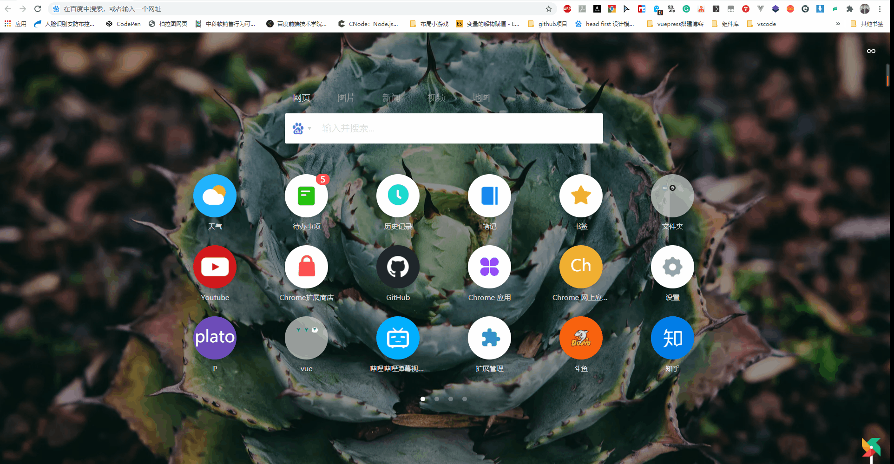
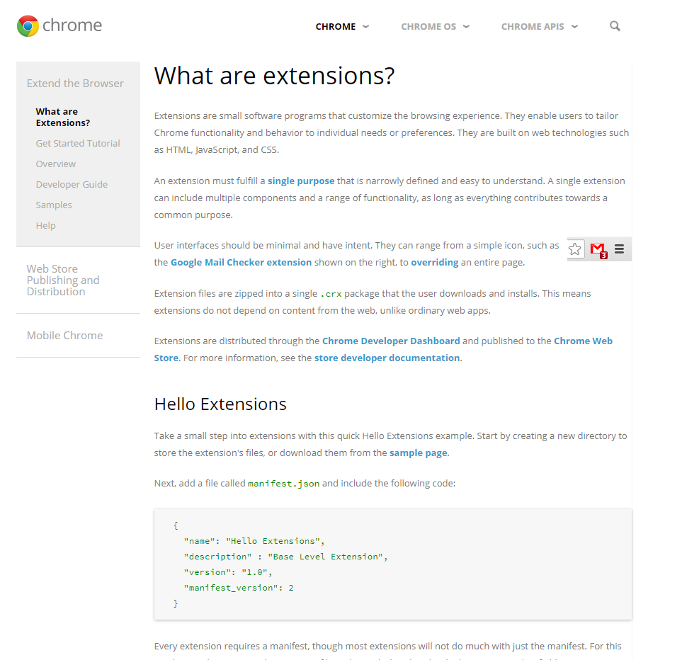
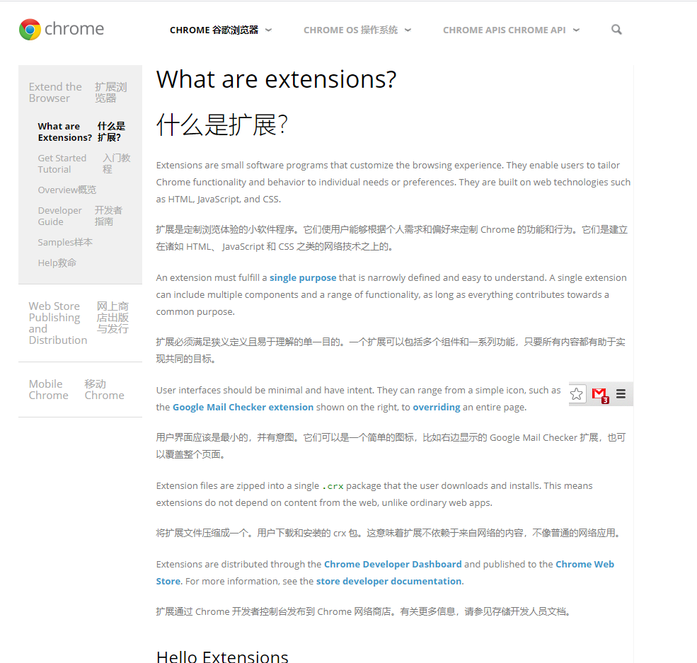
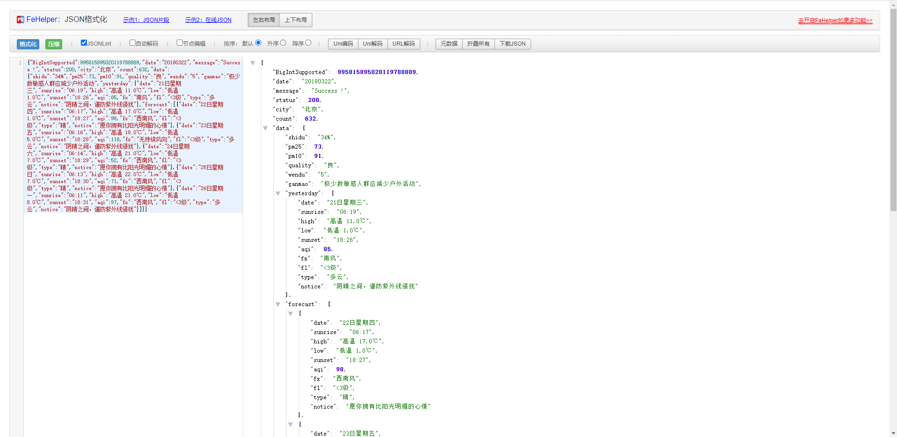
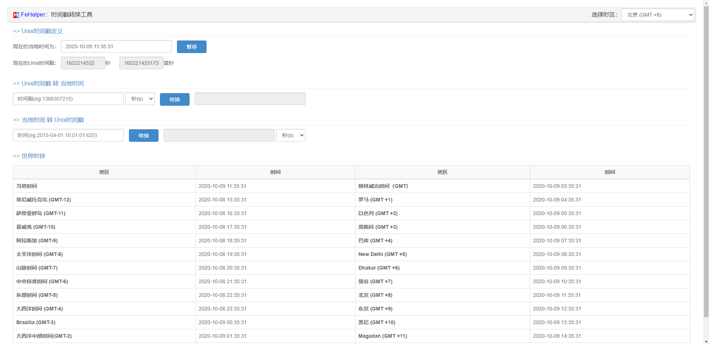
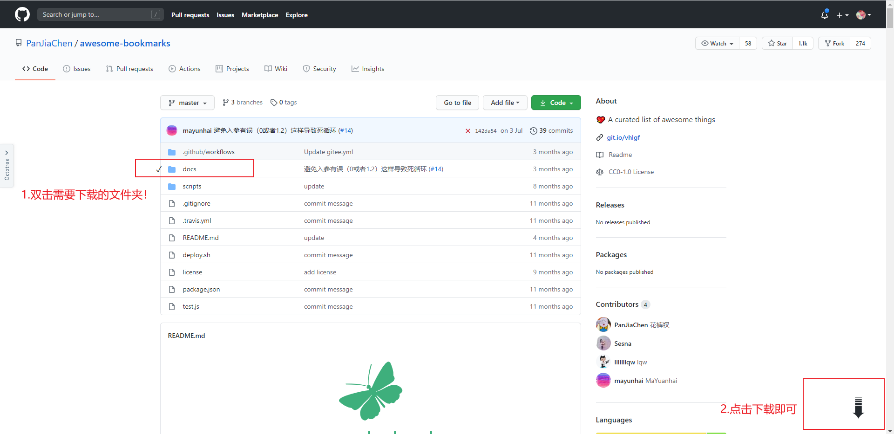
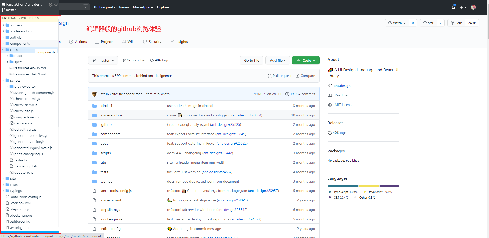

# 10. 福利篇

>作者：雷宇（leiyu@star-net.cn）

## 前期准备

我们要知道 Chrome 扩展是从 Chrome 扩展商店下载，我们国内的网络你懂的是没有办法进入 Chrome 扩展商店的，这边需要一个 Chrome 访问助手来帮助我们进入 Chrome 扩展商店。

我这边将[ Chrome 访问助手][1](提取码：p0w0)上传到百度网盘，同学们自行下载 ~

使用过程不多赘述...一图胜千言 ~

>完成这篇wiki前墙加高了，Chrome 访问助手暂时无法使用。ps：这个情况 5 月份出现过，后来恢复正常。

科学上网失败的情况，可以通过[ 扩展迷 ][2]这个网站来下载扩展 ~

[1]:https://pan.baidu.com/s/1sOUCUOCYU2Cfg0HbTxg42Q
[2]:https://www.extfans.com/

我们进入正题，推荐部分！！

## 最强翻译软件 —— 彩云小译

不多逼逼，直接上使用前后对比图。

### 使用前

### 使用后

对我这样英语一般的人真的太友好了！中英文对照阅读 ~

## 模拟IE —— IE Tab

模拟IE浏览器，如有适配IE浏览器的情况就可以使用。我一般用来等登录公司的网站。

## 开发助手 —— FeHelper
FeHelper 这个 Chrome 插件算是前端开发人员的小工具箱。有一些小功能如JSON格式化，时间戳转换以及图片转base64等功能。

### JSON格式化

### 时间戳转换

## 告别Git clone —— GitZip for github

我们在 GitHub 上找项目的时候可能遇到这种情况，我只需要项目的一个文件夹！但是没办法我们只能 git clone 将整个项目下载下来。我们有了 GitZip for github 就可以下载单个项目中的单个文件和文件夹了。

## GitHub浏览神器 —— Octotree - GitHub code tree

让你在 GitHub 浏览代码时给你感觉在编辑器中浏览的体验~

## 书签管理 —— tobymini
这是我用过最好用的书签管理工具， Chrome 自带的书签管理可以抛弃了。

## 科学上网 —— Astar Vpn

这个 Chrome 扩展可以直接让你科学上网，我本人查看 Chrome 扩展的开发手册就是使用它，平时休闲可上上油管啥的。还可以切换不同的节点，一个不行就换一个。用了大半年了，两个字，真香~ 本来不想让人知道这个 Chrome 扩展的，怕太多人用的话到时候被和谐了！想来看这篇 wiki 的人也不是很多，只有有缘人可以使用 ~

