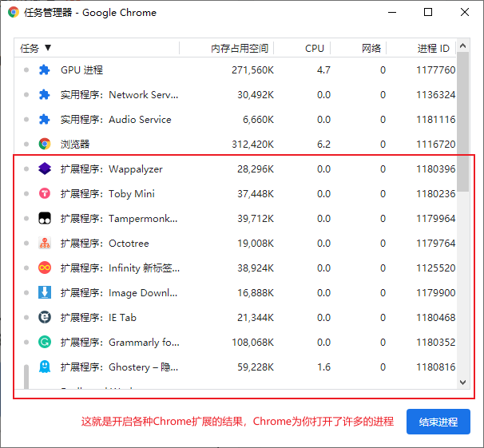

# 1. 认识谷歌插件（Chrome 扩展）

>作者：雷宇（leiyu@star-net.cn）

## Chrome 与 Chrome 扩展

Chrome 是 Google 公司基于 WebKit 开发的一款浏览器，时至今日从某种角度上来说，它的作用远远超越了浏览器，而是成为了一个平台，甚至是一个操作系统。

单进程浏览器时代的 Chrome 还只是一个耿直的 boy，所有的浏览器功能模块都运行在同一个进程中。同时，此时的浏览器包括 Chrome 功能不够完善，需要借助插件来实现 Web 视频、Web 游戏等各种强大的功能，但是插件是最容易出问题的模块，并且还运行在浏览器进程之中，所以一个插件的意外崩溃会引起整个浏览器的崩溃。

不过 Chrome 的发展是滚滚向前的，相较之前，目前的架构又有了很多新的变化。我们先看看最新的 **Chrome 多进程架构**：

从图中可以看出，最新的 Chrome 浏览器包括：**1** 个浏览器（Browser）主进程、**1** 个 GPU 进程、**1** 个网络（NetWork）进程、多个渲染进程和多个插件进程。我们可以打开 Chrome 任务管理器一探究竟，其中的插件进程就是为Chrome 扩展服务了，当我们开启了一项 Chrome 扩展就意味着多了一个插件进程。我这样的 Chrome 扩展的忠实粉丝，Chrome 真的是一个很占内存的存在。

---------------------------------------

## 认识 Chrome 扩展

Chrome 扩展是由 Web 技术开发，用来增强浏览器功能的软件。它其实是由一系列文件的集合，这些文件包括了 **HTML 文件**、**CSS 样式文件**、**JavaScript 脚本文件**、图片等**静态资源**以及 **manifest.json** 。看着这些熟悉的词汇就可以感觉出前端开发人员对于 Chrome 扩展的开发几乎是零门槛的。后续融合了 Vue Cli 脚手架，Chrome 扩展的开发更是简单！

我的开发使用感受来说，Chrome 扩展像是一个依附于 Chrome 的本地网站，但是它可以使用 Chrome 提供的丰富接口，获取 Chrome 几乎所有的信息，包括了 Chrome 正在浏览的页面内容，正在发起的请求，接收到的响应等等，甚至可以修改页面的 UI，修改请求实现 VPN 代理请求。每次想到这里不得感叹 Chrome 世界第一 ！

---------------------------------------

## Chrome扩展的主要成员

* **manifest.json**
* **background**
* **content-script**
* **popup**
* **options**
* **inject-script**
* **event-pages**
* **permissions**

后面我将重点介绍前四个我在云助理核赔扩展项目中实际应用的元素，剩下的部分穿插介绍。

下面是我学习 Chrome 扩展开发时主要查看的资料：

1. [【干货】Chrome插件(扩展)开发全攻略](http://blog.haoji.me/chrome-plugin-develop.html#homepage_url)
2. [手把手教你开发一个 chrome 扩展程序](https://juejin.im/post/6844904077889912839#heading-7)
3. [Chrome扩展及应用开发[提取码：agn8]](https://pan.baidu.com/s/1t9Sj66Gpx7QcOCto_sArPg)
