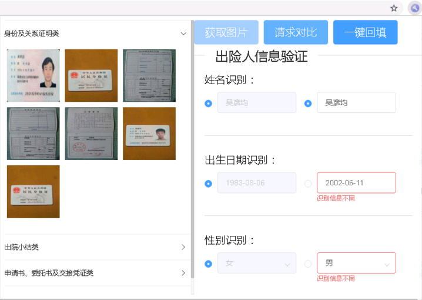
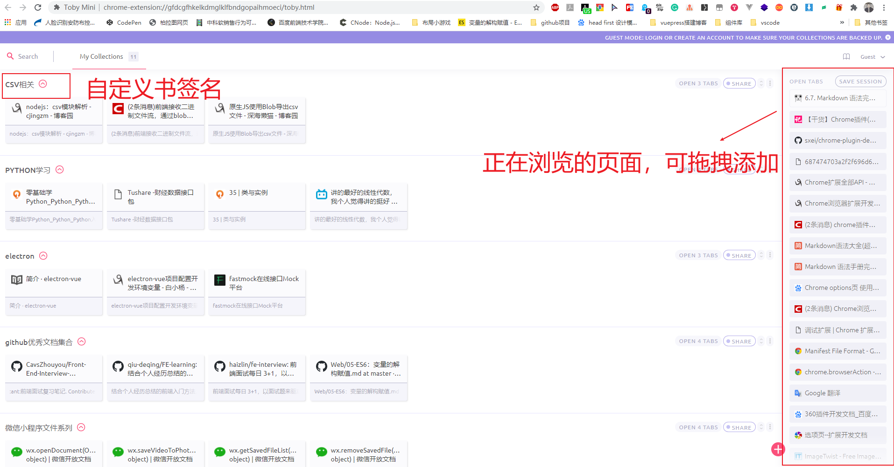

# Chrome 扩展中的形象代言人—— popup

>作者：雷宇（leiyu@star-net.cn）

## popup 简介

*popup* 页面是在用户在点击扩展图标时，图标下方弹出的展示页面。设计 *popup* 页面初衷更多是用于展示数据，而非处理数据。因为 *popup* 有着这样的特征——关闭*popup*页面就等于关闭了相应的标签页，页面将不会继续运行，当用户再次打开页面时，所有的 DOM 和 js 空间变量都将重新创建。

比较尴尬的是人寿 OCR 识别插件属于需要在 *popup* 页面上处理大量数据，开发时也是花了很大的精力来处理这个问题。还好有了常驻后台 *background* 来支持 *popup* 页面上的数据处理。 *popup* 页面可以通过 `chrome.extension.getBackgroundPage()` 获取 *background* 的 window 对象。这样数据缓存在常驻后台 *background* ，即使 *popup* 页面频繁的关闭开启也不用担心数据丢失了。

*popup* 页面是用户与扩展间彼此交互的窗口设计的好坏直接影响到了用户体验，所以应该加以重视。在[《Chrome扩展及应用开发》][1]一书有着详细介绍设计注意点。


#### Manifest 中 popup 的配置信息

``` JS
"browser_action": {
    "default_*popup*": "*popup*.html",
    "default_title": "__MSG_extName__",
    "default_icon": {
      "16": "icons/16.png",
      "48": "icons/48.png"
    }
  },
```
在Manifest中指定 *popup* 可以使Chrome扩展打开属于其自己的页面，借助该页面我们可以实现扩展与用户的交互。 *popup* 主要包含3种属性，分别为 *default_popup* 、*default_title* 和 *default_icon* 。

- default_popup：*popup* 页面指定的 html 文件。
- default_title：鼠标悬浮在 Chrome 扩展图标上显示信息
- default_icon：显示的图标的图片选项

---------------------------
## popup的功能

* 定义页面

*popup* 是插件可以自行构建页面的地方，我们甚至可以引入 *element-ui* 这样的 UI 库来帮助我们快速搭建页面。 Chrome 扩展在该页面上完成与用户的交互。

引入 *element-ui* 构建项目：
```js
import Vue from "vue";
import { Card, Button, Divider, Radio ,RadioGroup,Input,Image,Message,Select,Option,Collapse,CollapseItem,Form,FormItem,Icon,Dropdown,DropdownMenu,DropdownItem,Loading,Notification} from "element-ui";
import App from "./App.vue";

Vue.use(Card);
Vue.use(Button);
Vue.use(Divider);
Vue.use(Radio);
Vue.use(RadioGroup);
Vue.use(Input);
Vue.use(Image);
Vue.use(Select);
Vue.use(Option)
Vue.use(Collapse)
Vue.use(CollapseItem)
Vue.use(Form)
Vue.use(FormItem)
Vue.use(Icon)
Vue.use(Dropdown)
Vue.use(DropdownMenu)
Vue.use(DropdownItem)
Vue.use(Loading)

// Vue.use(Loading.directive)

 //Vue.prototype.$loading = Loading.service
Vue.prototype.$message = Message;
Vue.prototype.$notify = Notification;

/* eslint-disable no-new */
new Vue({
  el: "#app",
  render: h => h(App)
});
```



* 使用大部分Chrome提供的api

在权限上，它和 *background* 非常类似，在 *popup* 页面中可以使用大部分 Chrome 提供的 api 。这意味着我可以在页面上利用 Chrome 提供的 api 完成很多事情，像是获取常驻后台 *background* 实例就是利用 Chrome 提供的 `chrome.extension.getBackgroundPage()`api 实现的。

上面有提及 *popup* 页面的开启关闭都会使得所有的 DOM 和 js 空间变量重新创建。在人寿 OCR 识别插件中几乎所有的数据都缓存在了常驻后台 *background* 中，每次开启 *popup* 页面时后会利用 `chrome.extension.getBackgroundPage()` 获取缓存。还有，因为在 Chrome 扩展中只有在常驻后台 *background* 才能发起http请求，但是往往用户都是在交互页面 *popup* 上发起 http 请求的，这个时候也是利用 `chrome.extension.getBackgroundPage()` 访问常驻后台 *background* 中请求函数的。

```JS
// OCR 识别身份信息接口
async checkIdenity(imageList, angleList, id, retrieve) {
    const bgPage = chrome.extension.getBackgroundPage();
    const idenityInfo = await bgPage.checkIdenityInfo(
      imageList,
      angleList,
      id,
      retrieve
    )
}
//访问常驻后台 background 实例赋值
const bgPage = chrome.extension.getBackgroundPage();
this.idenityClass = bgPage.idenityClass;
this.idenityImgArr = bgPage.idenityImgArr;
```
-----------------------------

## options 配置页

这里顺便提及一下 *options* 配置页，*options* 配置页和 *popup* 页面有着很多相似之处，都是可以自行根据需求构建页面。有的 Chrome 扩展是通过 *popup* 页面与用户之间进行交互的，而有的是通过 *options* 配置页。


有一款我特别喜欢的 Chrome 扩展—— Toby ，就是利用 *options* 配置页进行交互的。这是一款书签管理扩展，在舒服的界面来管理书签，这一点征服了我。强烈推荐！



因为我本人还没有写过 *options* 页面，大致流程应该与 *popup* 页面的构建方式一致。有兴趣的同学可以尝试一波~


[1]:https://pan.baidu.com/s/1p1dVIS4SIoQzNMOacBAyTg
