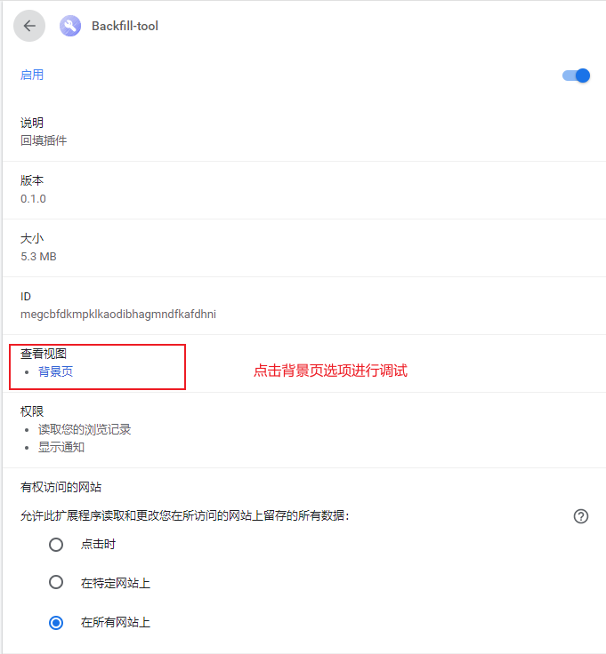
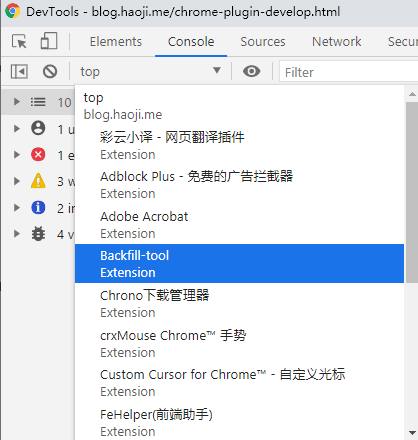
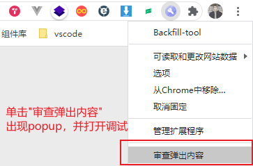

# Chrome扩展成员之间的通讯及调试方法

>作者：雷宇（leiyu@star-net.cn）

## 前言

前面已经详细介绍常驻后台 *background* 、 *content-script* 以及 *popup* 页面，这个章节我将介绍它们三者之间的通讯方法以及各自的调试方法。

Chrome 扩展能在 Chrome 中发挥出我们想要的效果，不可能只依靠于一个成员，必须是三个成员相互合作的结果。那么合作的方式就是进行相互之间的通信。

开发 Chrome 插件排查问题的过程相对于普通 web 开发麻烦了一些，常驻后台 *background* 、 *content-script* 和 *popup* 页面三者的调试都是独立的，但是问题不大。通过简单的介绍也是可以轻松掌握调试的技巧。

-----------------------
## 通讯

### 通讯预览

|  | background-js | content-script |popup.js|
| :-------- | --------| :--: |:--: |
| background-js | |chrome.tabs.sendMessage chrome.tabs.connect  | chrome.extension.getViews |
| content-script |chrome.runtime.sendMessage chrome.runtime.connect|  |chrome.runtime.sendMessage chrome.runtime.connect |
| popup.js | chrome.extension.getBackgroundPage() | chrome.tabs.sendMessage chrome.tabs.connect ||

### 通讯详细介绍

#### background 和 content 之间的通信

这里用云助理核赔扩展的部分代码来演示：

##### background 发信息给 content


```JS
//background.js
chrome.tabs.query({
    active: true,
    currentWindow: true
  }, (tabs) => {
    let message = {     //发送的信息
      type: '3',
    }
    chrome.tabs.sendMessage(tabs[0].id, message, res => {
      console.log('收到了cotent-script回复', res)     //回调函数，用于执行后面的逻辑
  })
```

```js
//content-script
chrome.runtime.onMessage.addListener((request, sender, sendResponse) => {
   if (request.type === '3') {
    sendResponse('我收到了你的消息，background~')
    clickBankInfo()
  }
})

```

##### content 发消息给 background

```js
// content-script
chrome.runtime.sendMessage({
  initBankInfo: bankInfo,
}, res => {
  // 答复
  console.log('backgound的回复', res)
})
```

```JS
// background接收来自content.js的传值
chrome.runtime.onMessage.addListener(async (req, sender, sendResponse) => {
  //接收页面上银行信息
  if (req.initBankInfo) {
    window.initBankInfo = req.initBankInfo
  }
}
```

#### popup 和 content 之间的通信

##### popup 发信息给 content

```JS
//popup.js发送信息
chrome.tabs.query(
 {
   active: true,
   currentWindow: true
 },
 tabs => {
   if (tabs[0].url.includes("10.20.30.85:7001")) {
     this.isImg = false;
   }
   if (tabs[0].url.includes("http://cbps.clic/index.html")) {
     let message = {
       type: "0"
     }
     chrome.tabs.sendMessage(tabs[0].id, message, res => {
       console.log(res);
     })
   }
 }
)
```

```JS
//content.js获取popup.js发送的信息
chrome.runtime.onMessage.addListener((request, sender, sendResponse) => {
  if (request.type === '0') {
    //获取出险人信息
    getInsurantInfo()
    //获取出险信息部分
    getAccidentInfo()
    //获取申请人信息
    getApplicantInfo()
  }
})

```

> 可以看出两者的通讯方式是一摸一样的。

#### popup 和 background 之间的通信

*popup* 和 *background* 之间的通信和上面两种有点不太一样，上面两者之间存在“发送”和“接收”关系。 *popup* 和 *background* 之间的通信是主动获取的，在 *popup* 页面中想要 *background* 中的内容直接通过 `chrome.extension.getBackgroundPage()` 获取，相反， *background* 想要获取 *popup* 中的内容可以通过 `chrome.extension.getViews()` 获取。

##### popup 获取 background 内容

```js
//popup.js
import _ from "lodash";
// 获取*background*实例
const backPage = chrome.extension.getBackgroundPage();
//延时处理
setTimeout(() => {
  // 如果backPage存在上一次的信息
  if (backPage.initInsurantInfo) {
    this.initInsurantInfo = _.cloneDeep(backPage.initInsurantInfo);
  }
  if (backPage.compareInsurantInfo) {
    this.compareInsurantInfo = _.cloneDeep(backPage.compareInsurantInfo);
}, 2000);
```

##### background 获取 popup 内容

> 开发中未使用过这个方法，使用网上了的demo

```js
// 获取所有 tab（前提是 popup 是打开的）
const pups = chrome.extension.getViews({
    type: 'popup'
}) || []

// 输出第一个使用插件页面的 url
if (pups.length) {
    console.log(pups[0].location.href)
}
```
#### 长连接

其实上面的表格涉及到了，这里再单独说明一下。 Chrome 插件中有 **2** 种通信方式，一个是短连接（ `chrome.tabs.sendMessage` 和 `chrome.runtime.sendMessage` ），一个是长连接（ `chrome.tabs.connect` 和 `chrome.runtime.connect` ）。

在云助理核赔扩展中大多是使用了短连接，上面的用于演示的代码片段都是短连接。短连接的话就是挤牙膏一样，我发送一下，你收到了再回复一下，如果对方不回复，你只能重新发，而长连接类似 WebSocket 会一直建立连接，双方可以随时互发消息。

云助理核赔扩展只是简单运用了这个方法来监听 *popup* 开启关闭：

```JS
//popup.js
//建立连接
var port = chrome.runtime.connect()
```

```JS
//*background*.js
chrome.runtime.onConnect.addListener((externalPort) => {
  //断开连接后发起请求
  externalPort.onDisconnect.addListener(async () => {
    var ingoreError = chrome.runtime.lastError
    const offLockRes = await checkLock("off", window.initCaseId, 'no');
  })
})
```
--------------------------------------

## 调试


|  <div style="width: 150pt">类型</div> | 调试方式 | 附加图片说明|
| :----------------- | :--------| :-- |
| background-js |点击“管理扩展程序”进入Chrome扩展页，点击“背景页”进入调试 | |
| content-script |F12如图找到对应的Chrome拓展进行调试，其实*content-script*的调试也可以不选特定的Chrome扩展也可以进行调试，F12也可以输出*content-script*的各种信息|  |
| popup.js | 右击Chrome图标后，点击“审查弹出内容”即可调试*popup*页面 |  |
