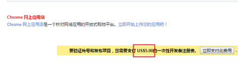

# 利用Vue Cli脚手架开发Chrome扩展

>作者：雷宇（leiyu@star-net.cn）

## 前言

只要一个文件夹包括了前面几个章节提到的要素就可以组成一个 Chrome 扩展，我们开发过程肯定不可能直接编写，这时候我们肯定需要借助 Vue Cli 脚手架的帮助。本人水平实在有限，无法独立完成项目工程化。所以借鉴了之前顺豪的架子,同时根据网上的资料针对项目做了一些改进。

此项目基于 Vue-Cli4 搭建，使用 <font color=red>vue-cli-plugin-browser-extension</font> 插件构建开发 Chrome 扩展的环境，如扩展热更新、打包后自动压缩成 zip 或者 crx 格式，更多详情点[这里](https://github.com/adambullmer/vue-cli-plugin-browser-extension)

后续有兴趣开发 Chrome 扩展的同学可以直接使用这个[模板][1]，或者在 Github 上自行搜索 Chrome 扩展开发模板。

-------------------------
## 项目结构
```
📦src
 ┣ 📂api
 ┃ ┗ 📜index.js
 ┣ 📂components
 ┃ ┗ 📜HelloWorld.vue
 ┣ 📂content              // 内容页，向页面注入脚本
 ┃ ┣ 📂components
 ┃ ┃ ┗ 📜SideBar.vue
 ┃ ┗ 📜index.js
 ┣ 📂options              // 插件的设置页面，右键扩展图标有一个"选项" 菜单
 ┃ ┣ 📜App.vue
 ┃ ┗ 📜main.js            //options打包入口文件
 ┣ 📂popup                // 点击 chrome 图标时打开的一个小窗口网页，焦点离开就立即关闭，一般用来做一些临时性的交互
 ┃ ┣ 📜App.vue
 ┃ ┗ 📜main.js             //popup打包入口文件
 ┣ 📂utils
 ┃ ┣ 📜crx.js              // 生成crx格式的压缩包
 ┃ ┗ 📜request.js          // 对 axios 进行二次封装
 ┣ 📜background.js         // 随着浏览器一直存在，权限非常高，几乎可以调用所有的扩展 API，可以无限制跨域
 ┗ 📜manifest.json         // 所有和 Chrome 扩展相关的配置
```
----------------------
## 引入 element UI

我们在构建 *popup* 页面、*options* 配置页以及使用 *content-script* 修改网页 DOM 的时候，就可以引入 <font color=red>element UI</font> 帮助我们快速的搭建页面。

``` js
npm install element-ui --dev
```
然后修改 `babel.config.js` 。

```js
module.exports = {
  presets: ["@vue/cli-plugin-babel/preset"],
  plugins: [
    [
      "component",
      {
        libraryName: "element-ui",
        styleLibraryName: "theme-chalk"
      }
    ]
  ]
}
```
比如要在 *popup* 页面使用 <font color=red>element UI</font> ，就在 *popup* 页面的打包入口文件引入 <font color=red>element UI</font> 的依赖,同理可以在 *options* 配置中和 *content-script* 中使用。

``` JS
//popup的打包入口文件
import Vue from "vue";
import { Card, Button } from "element-ui";
import App from "./App.vue";

Vue.use(Card);
Vue.use(Button);
/* eslint-disable no-new */
new Vue({
  el: "#app",
  render: h => h(App)
})
```
-----------------------
## 引入 vue-cli-plugin-browser-extension

```JS
npm install vue-cli-plugin-browser-extension
```

这个模板主要是基于 [vue-cli-plugin-browser-extension][2] 这个依赖进行打包 Chrome 扩展相关的文件。可以去 GitHub 上查看更加详细的配置。我们的模板只是简单的利用它完成了 *background* 和 *content-script* 的打包。

```JS
//vue.config.js
pluginOptions: {
  browserExtension: {
    componentOptions: {
      background: {
        entry: "src/background.js"
      },
      contentScripts: {
        entries: {
          content: ["src/content/index.js"]
        }
      }
    }
  }
}
```
--------------------------
## 引入 crx

如果 Chrome 扩展需要发布到谷歌扩展商店，必须要以 crx 格式的压缩包（ crx 文件本质就是 ZIP 文件，只是谷歌在 ZIP 文件头，插入了自定义的私有字段，如，插件描述，插件 ID ，密钥等）。[详情看这里][3]。关于发布部分，本人没有整理，相信有心人可以完成。(主要我太穷了~ 我没有钱)



所以必要情况下加入了特定的脚本帮助我们打包出 crx 文件格式的压缩包。

```js
npm install crx
```

```js
//crx.js
const fs = require("fs");
const path = require("path");
const manifest = require(path.resolve(__dirname, "../manifest.json"));
const ChromeExtension = require("crx");
const crxName = `${manifest.name}-v${manifest.version}.crx`;
const crx = new ChromeExtension({
  privateKey: fs.readFileSync(path.resolve(__dirname, "../../artifacts.pem"))
});

crx
  .load(path.resolve(__dirname, "../../dist"))
  .then(crx => crx.pack())
  .then(crxBuffer => {
    fs.writeFile(crxName, crxBuffer, err =>
      err
        ? console.error(err)
        : console.log(`>>>>>>>  ${crxName}  <<<<<<< 已打包完成`)
    );
  })
  .catch(err => {
    console.error(err);
  });

```


[1]:https://github.com/lemonly14/vue-extension-template
[2]:https://github.com/adambullmer/vue-cli-plugin-browser-extension
[3]:https://blog.csdn.net/wanwuguicang/article/details/79742017
