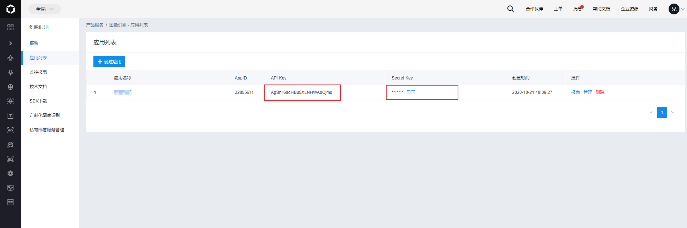
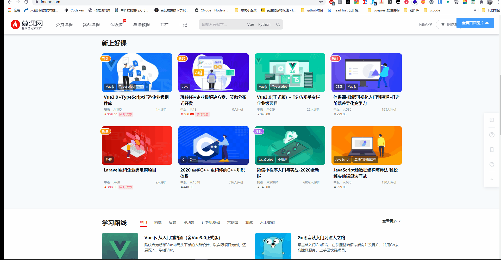
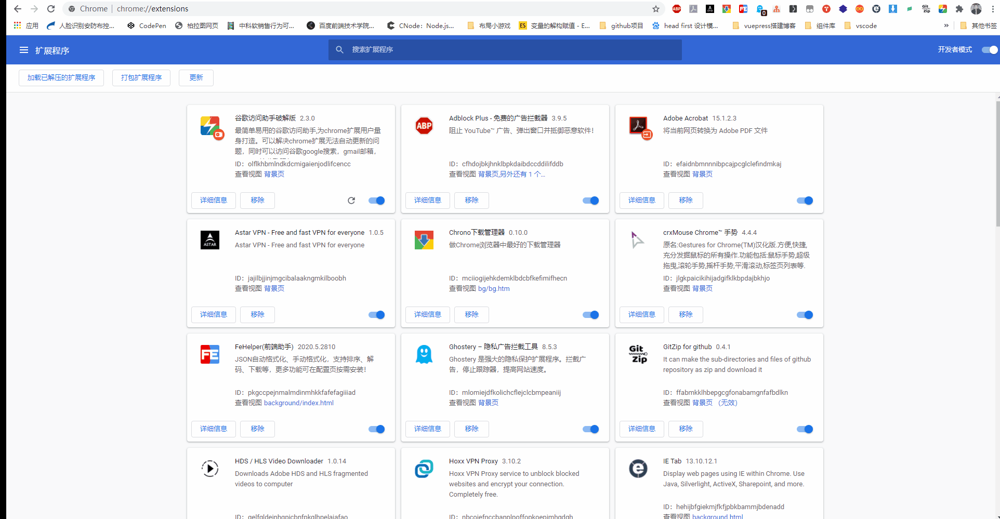
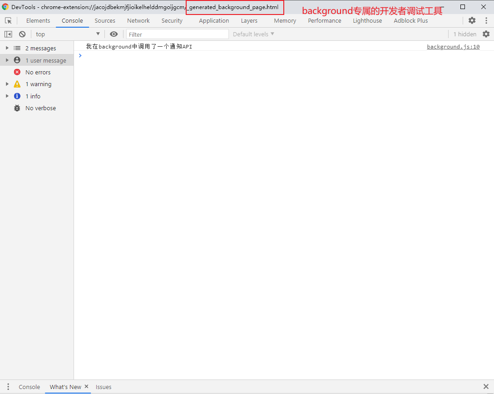
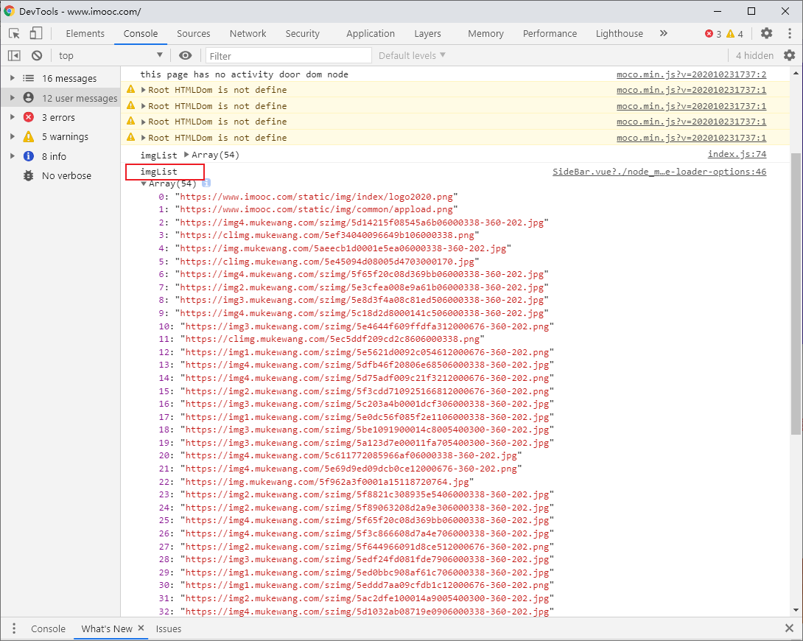
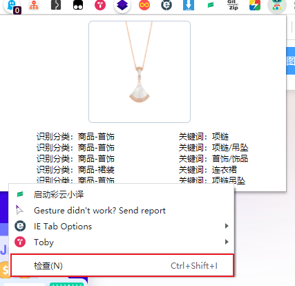
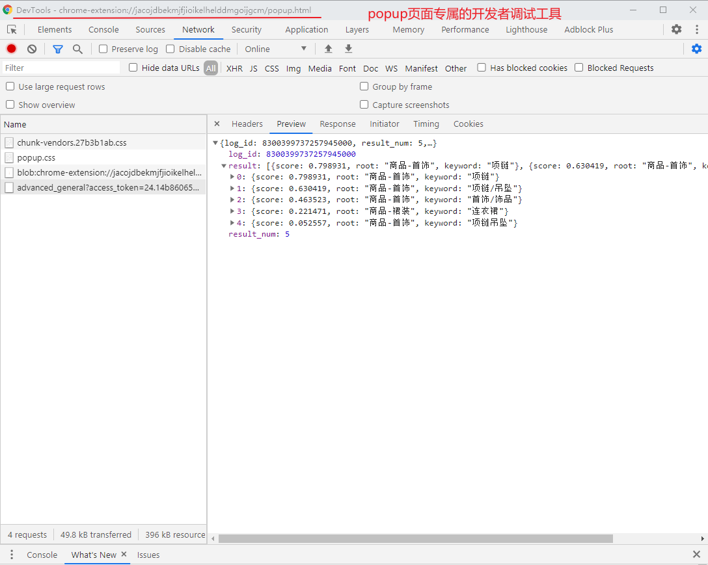
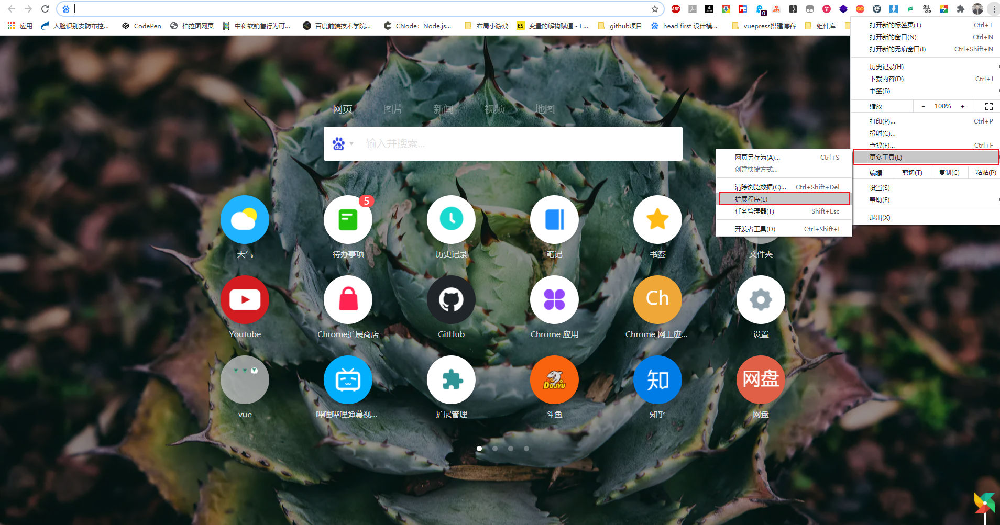
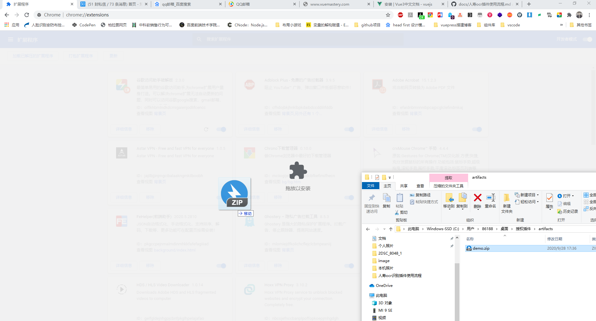
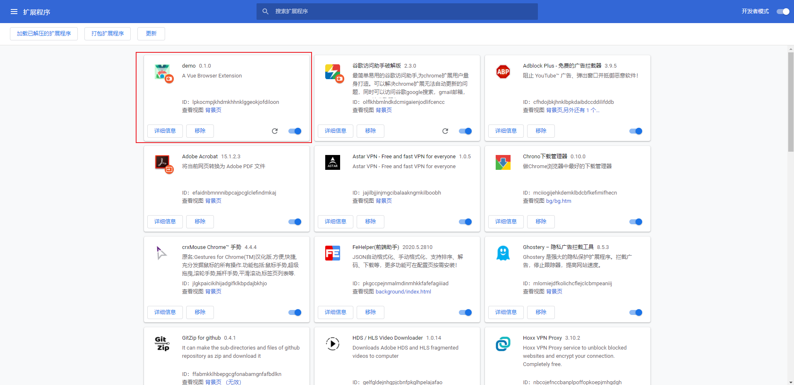

# 9. demo 扩展开发演示
>作者：雷宇（leiyu@star-net.cn）

## demo 扩展概述

这个演示 demo 扩展是借助百度通用物体和场景识别 api 识别上传的图片并返回识别到的文字字段，用户点击识别字段自动跳转到该字段的百度界面，并且可以捕获页面上所有的图片。

可以看到这个demo主要有以下的能力：

>1.使用 Chrome 扩展发起请求
>2.使用 Chrome 扩展 api 操控 Chrome 浏览器
>3.使用 Chrome 扩展捕获页面信息

这些能力也是云助理核赔扩展的能够实现项目主要需求的依托点。

源码位于：https://git.starnetiot.net/starnetiot-wiki-demo/chrome-extension-demo

## 开发阶段

### 调用百度识别 api

#### 注册百度识别应用

我们可以个人的名字注册一个百度识别应用(这里就省去一万个字...)，注册完成后会显示该应用的API Key 和 Secret Key。



#### 获取 access_token

获得 API Key 和 Secret Key 后执行下面的方法(node 版)获取 access_token 。

``` js
var https = require('https');
var qs = require('querystring');

const param = qs.stringify({
    'grant_type': 'client_credentials',
    'client_id': 'AgShii68dHBu5XLNHWAbCjmo',
    'client_secret': 'WAAqYFoF9UWG8oEdQXCntAUNXF3EGdq7'
});

https.get(
    {
        hostname: 'aip.baidubce.com',
        path: '/oauth/2.0/token?' + param,
        agent: false
    },
    function (res) {
        // 在标准输出中查看运行结果
        res.pipe(process.stdout);
    }
);

```
这里是 node 版的方法，还有 bash 版、Java 版等等。[详情](https://ai.baidu.com/ai-doc/REFERENCE/Ck3dwjhhu)看这里

执行该方法后的结果:

```json
{
    "refresh_token": "25.48448516dd29721f9875216f1bc74528.315360000.1919052715.282335-22855611",
    "expires_in": 2592000,
    "session_key": "9mzdCXJH/q2kWChBQPiEhX0kwTfR+NPFbWDZIoJA8wuJy/T6xnnxZSRb7MS6erH5GSjBPqsOIvrywiKL88uPlqq1h/pI4g==",
    "access_token": "24.2xxxxxxxxxxxxxxxxxxxxxxxxxxxxxxxxxxxxxxxxxxxxxxxxxxx1",
    "scope": "public vis-classify_dishes vis-classify_car brain_all_scope vis-classify_animal vis-classify_plant brain_object_detect brain_realtime_logo brain_dish_detect brain_car_detect brain_animal_classify brain_plant_classify brain_ingredient brain_advanced_general_classify brain_custom_dish brain_poi_recognize brain_vehicle_detect brain_redwine brain_currency brain_vehicle_damage wise_adapt lebo_resource_base lightservice_public hetu_basic lightcms_map_poi kaidian_kaidian ApsMisTest_Test权限 vis-classify_flower lpq_开放 cop_helloScope ApsMis_fangdi_permission smartapp_snsapi_base smartapp_mapp_dev_manage iop_autocar oauth_tp_app smartapp_smart_game_openapi oauth_sessionkey smartapp_swanid_verify smartapp_opensource_openapi smartapp_opensource_recapi fake_face_detect_开放Scope vis-ocr_虚拟人物助理 idl-video_虚拟人物助理 smartapp_component",
    "session_secret": "34e3d68217504e266ced2bbd3a5d68dc"
}
```
我们取出后续请求需要带上的 **access_token**
#### 封装接口

```js
import request from "@/utils/request";

const access_token = '24.14xxxxxxxxxxxxxxxxxxxxxxxxxx'  // 假的access_token 但是当你获取到24开头的access_token是没有问题的。

export function getInfo(data) {
  return request({
    url: `/advanced_general?access_token=${access_token}`,
    method: "post",
    data,
    headers: {
      'Content-type': 'application/x-www-form-urlencoded'
    },
  });
}
```

### 操控 Chrome 浏览器

demo 扩展主要利用开启的 tabs 权限来帮助我们打开新的 tab 页面，并在调用Chrome提供的tabs的api时带上百度的地址，就可以实现这个效果。

#### 开启 tabs 权限

```JS
//
"permissions": [
   "tabs",         // 标签
   "http://*/*",   // 可以通过executeScript或insertCSS访问网站
   "https://*/*",
   "<all_urls>",
],

```

#### 点击调用 tabs API

``` JS
// html
<div class="keyword"
     v-for="(item,index) in keywordLsit"
    :key="index + 'item1'"
     @click="searchKey(item)">关键词：{{item}}</div>

// js
searchKey(val) {
    let params = {}
    params.url = `https://www.baidu.com/s?ie=utf-8&wd=${encodeURIComponent(val)}&tn=78040160_14_pg&ch=8`
    chrome.tabs.create(params)
}

```

### 捕获页面信息

页面加载完成后利用 *content-script* 可以与页面DOM通信的特性可以帮助Chrome扩展获取DOM元素。

获取页面所有的图片信息：

```js
const imgDomList = document.getElementsByTagName('img')
const imgList = []
imgDomList.forEach(item => {
imgList.push(item.currentSrc)
```




以上就是这个demo扩展主要的三种能力。

## 调试扩展

### 热更新调试

使用这个Vue Cli脚手架开发Chrome扩展是支持热更新的，我在项目中设置npm run dev来生成用于热更新的文件夹dist。每次文件有发生更新的情况就可以立即更新，基本和我们平时开发web项目的体验一致。

执行完成npm run dev命令行会生成dist文件夹，只需将该文件拖入扩展管理页即可。



### background调试

这个demo扩展中通过调用background中的函数来调试，我将会在这个函数中简单打印一个信息。

```js
window.getDataSuccess = function () {
  console.log('我在background中调用了一个通知API');
  chrome.notifications.create(null, {
    type: "basic",
    iconUrl: "icons/128.png",
    title: "图片上传扩展",
    message: "调用百度识别API成功"
  });
}
```
我们验证一下，打开background的开发者调试工具看看。



### content-script调试

*content-script* 的调试是可以理解成我们平时页面的调试，在 *content-script* 里创建的DOM元素和JS变量都会和页面上的共存。所以我们可以按F12直接打开页面对 *content-script* 进行调试。

我们利用Vue.component()在页面上以组件的形式加入我们自定义的DOM元素，通过父子组件传值的形式给这个组件传入存在页面上的JS变量。

这里我们简单验证一下，查看 *content-script* 中加入的DOM元素和JS变量。

```js
//content-script
import SideBar from "./components/SideBar";
Vue.component("side-bar", SideBar);
let sideBar = document.createElement("div");
sideBar.id = "z-upload";
sideBar.innerHTML = "<side-bar :img-list=imgList></side-bar>";
let mainDom = document.getElementsByTagName("body")[0];
mainDom.appendChild(sideBar);
new Vue({
  el: "#z-upload",
  data: {
    imgList
  }
});

//SideBar.vue  打印传入的imgList
props: {
  imgList: {
    type: Array,
    default() { }
  }
}

mounted() {
  console.log('imgList', this.imgList)
},

```




这里我们看到 *content-script* 创建的 id 为 **z-upload** 的 DOM 元素以及名为 **imgList** 的 JS 变量。

### popup页调试

打开 Chrome 扩展的 popup 页面，直接右键 popup 页面单击“检查”选项。



会出现我们平时看到的开发者调试工具，但是这个是专属于 popup 页面的。在里面可以查看 popup 页面的 DOM ，以及该页面的请求等等。这里可以看到在 popup 页面发起的请求返回。



## 扩展安装

在这个 Chrome 扩展开发脚手架里打包扩展也是很简单的，我这里直接设置成 npm run build 来打包拓展。在根目录下的 artifacts 文件夹下生成 Chrome 扩展的 zip 压缩包。

首先按照下图进入谷歌浏览器的扩展管理页面。



接下我们将看到如下图的页面，我们如果看到右上角的开发者模式是关闭的。我们需要先将其开启，否则无法安装 demo 扩展。

开启开发者模式之后，我们可以直接将 demo 扩展拖入扩展管理页面并施放鼠标右键安装。操作如图所示。



然后可以看到这样的效果~ 右上角可以看到我们刚刚安装的 demo 扩展了。


