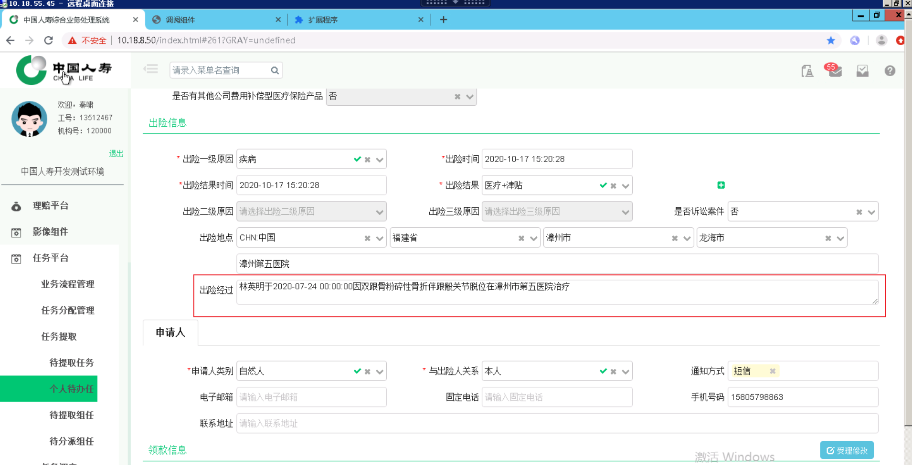

## 1. 前言

云助理核赔插件是针对人寿保单管理系统开发的扩展，云助理核赔插件的作用主要为检查页面信息、修正错误内容以及减少人工录入加快审核速度。扩展通过获取保单影像资料，并进行针对性地进行 OCR 识别获得影像信息。同时，此扩展可以自动获取页面原有保单信息，两者信息进行对比。用户可以自行选择信息或者修改信息。最后将选中的内容回填至页面中。

接下来，我将云助理核赔插件使用流程分为四个模块进行介绍，分别是安装、保单基础信息、保单领款信息以及医疗票据清单信息。

## 2. 安装

首先按照下图进入步骤谷歌浏览器的扩展管理页面。

接下我们将看到如下图的页面，我们可以看到右上角的开发者模式是关闭的。我们需要先将其开启，否则无法安装云助理核赔插件。

开启开发者模式之后，我们可以直接将云助理核赔插件拖入扩展管理页面并施放鼠标右键安装。操作如图所示。

然后可以看到这样的效果~ 右上角可以看到我们刚刚安装的扩展了。

## 3.保单基础信息

保单基础信息包括出险人信息，出险信息等等。它是整个识别回填流程最早进行操作的模块。

因此，我们将影像处理和部分功能介绍放在这个模块。接下来我们开始一一介绍...

### 3.1 自动获取保单信息

我们进入保单初始页（这里将刚开始进入保单的页面定义为“保单初始页”，下同），点开扩展可以自动获取保单基础信息( 包括了出险人信息、出险信息以及申请人信息 )。

### 3.2 获取影像

我们点击保单初始页的“本次影像”按钮进入保单影像页面，如下图

进入保单的影像资料页面，点击扩展的获取图片按钮。扩展将获取用于识别的影像，总共六大类分别为身份及关系证明类、出院小结类、申请书、委托书及交接凭证类、银行卡及存折首页复印件类、医疗票据类以及医疗清单类。扩展将根据影像类别进行细分并调整影像方向。

### 3.3 影像调整与查看

虽然在获取影像资料环节已经进行了调整影像方向。但是我们不能保证调整万无一失。所以我们需要进行人工校正影像方向。影像方向正确的情况下，OCR 识别的效果是最优秀的，识别速度是最快的，所以扩展支持影像调整方向，同时也支持放大查看影像功能。

### 3.4 影像识别

调整完成影像方向之后，便可以点击请求对比进行OCR识别。请求时长视照片数量而定，在保单初始页面会针对四个类进行识别。分别为身份及关系证明类、出院小结类、申请书、委托书及交接凭证类以及银行卡及存折首页复印件类。

#### 3.4.1 识别中

#### 3.4.2 识别完成

识别完成之后会显示OCR识别后并处理的结果，扩展中默认左侧的信息为页面内容，也是我们默认勾选中的内容。而右侧为我们OCR识别出来的信息，二者陈列对比。但出现识别信息与页面信息不同时，将会提示信息不同。扩展也支持日期、电话、身份证格式校验。

### 3.5 回填保单基础信息

保单基础信息包括了出险人信息、出险信息以及申请人信息，这里我们以出险经过这个比较有代表性的例子。

#### 3.5.1 回填前

看下图，我们知道保单原始的出险经过是空白的。

我们选择 OCR 识别出的并经过前端按照规则拼接过的信息，并点击一键回填。

可以看到页面上出现了回填的信息。

## 4.回填保单领款信息

保单领款信息的回填操作需要进入受理修改页面（点击“受理修改”按钮后进入的页面称为“受理修改页”，下同）。

当我们进入受理修改页时，扩展会自动判定用户所在的页面。并只显示银行卡信息的相关内容，如下图所示。
回填步骤同 3.5 节回填保单基础信息一致，选中信息并点击一键回填即可。

## 5. 医疗票据、医疗清单信息

### 5.1  回填医疗票据信息

我们进入票据初审页。打开扩展，同理扩展会自动判断用户所在的页面，并只展示医疗票据及清单相关的内容，如下图所示。上面初始化内容为第一轮 OCR 识别保留的内容。

由于医疗票据及清单的识别较为特殊，医疗票据和清单可能存在多份（票据和清单存在一对多的关系），所以需要认为勾选需要识别的医疗票据及清单。遇到多份的情况下，就需要多次识别。

识别后会提取票据信息，如诊疗方式、票据号等等。同时医疗清单识别完成后扩展会生成一份医疗项目清单的CSV文件。

### 5.2 回填医疗票据信息

上一个环节识别完成后会生成医疗项目清单的CSV文件，这个文件导入扩展后，扩展会进行解析数据。并自动填充医疗清单信息，效果如下图。

#### 准备导入

#### 选择导入文件(仅限识别出的医疗清单CSV文件)

#### 正在解析CSV文件

#### 解析完成并自动回填

